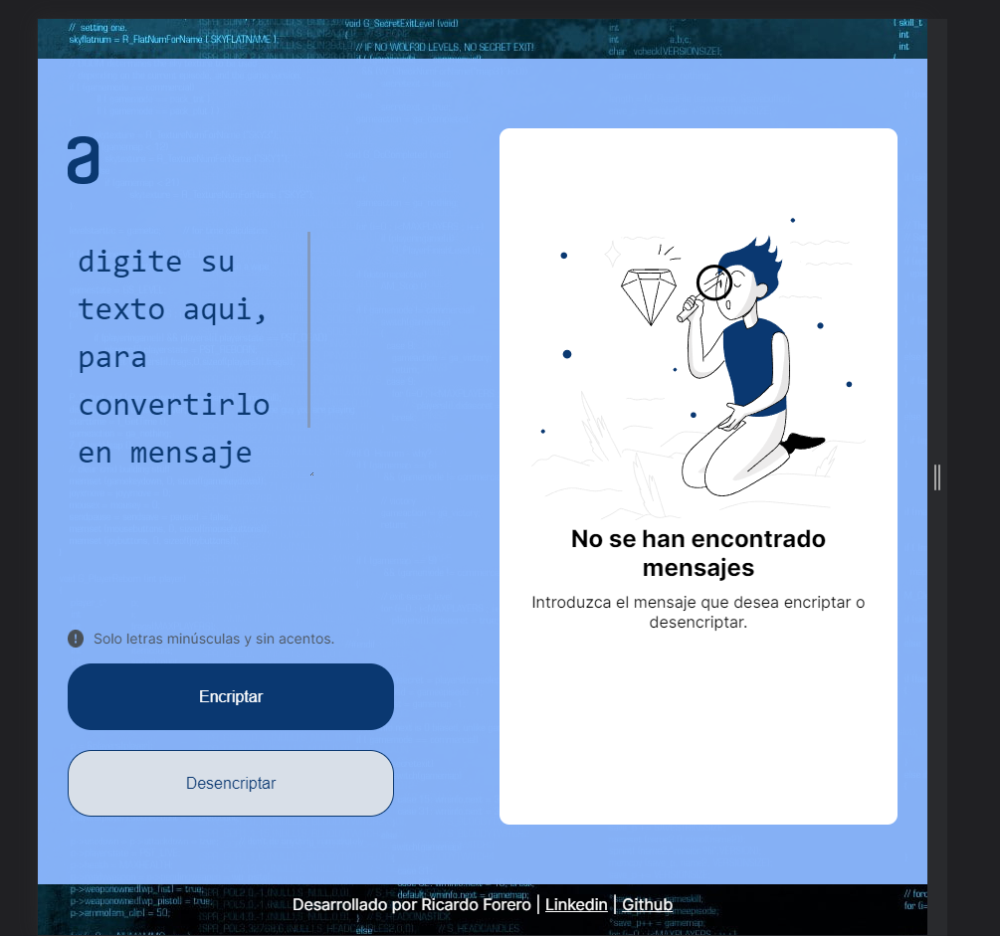

# Reto Alura | Encriptador - Desencriptador

> Este desafío Alura propuso la creación de un Message Encryptor/Decryptor. Los sprints del proyecto fueron enviados por Trello, que también incluía diseños de Figma, para simular la vida diaria de un desarrollador.

  

## Encriptador | Desencriptar

Debe aceptar solo letras minúsculas y sin acento.

  

### Cifrar el mensaje

La idea es reemplazar:

- [x] a por ai
- [x] e por enter
- [x] i por imes
- [x] o por ober
- [x] u por ufat

  

### botón de cifrado

Después de escribir el mensaje en la ubicación indicada y hacer clic en Cifrar, el mensaje aparece cifrado en el campo al lado.
El carácter desaparece y aparece un botón Copiar justo debajo del mensaje.

Si el usuario hace clic en Cifrar, sin ningún mensaje, aparece una alerta que le informa que debe escribir algo.

  

### Botón de Copiar

Al hacer clic en el botón Copiar, aparece una Alerta informando al usuario que el mensaje ha sido copiado.

  

### Botón de Descifrar

Después de pegar o escribir el mensaje en el lugar indicado, aparece sin cifrar en el campo al lado.

Si el usuario hace clic en Descifrar, sin ningún mensaje, aparece una Alerta informándole que necesita escribir algo.

  

## Capacidad de respuesta

Tampoco era obligatorio dejar el layout responsive, pero como estoy en fase de aprendizaje, aproveché para poner a prueba los conocimientos adquiridos hasta el momento.

